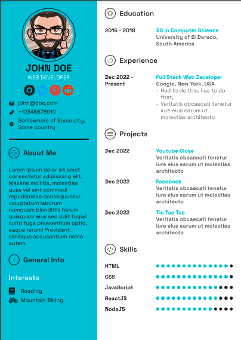
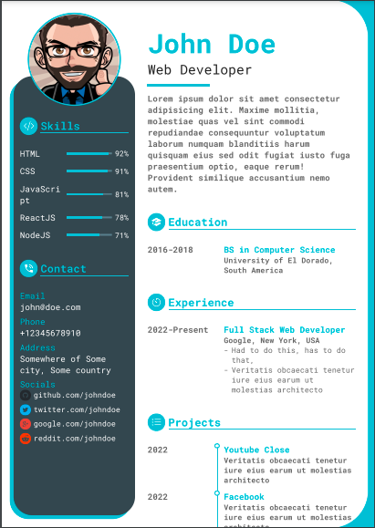
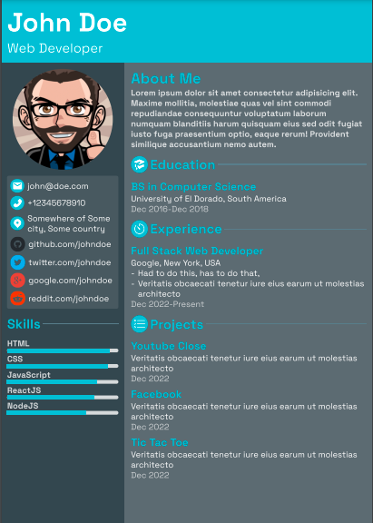
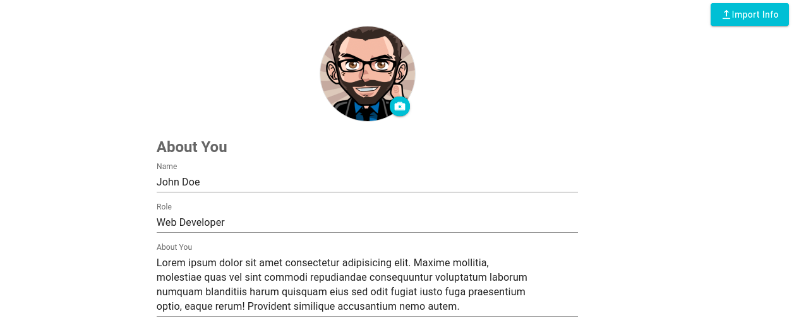
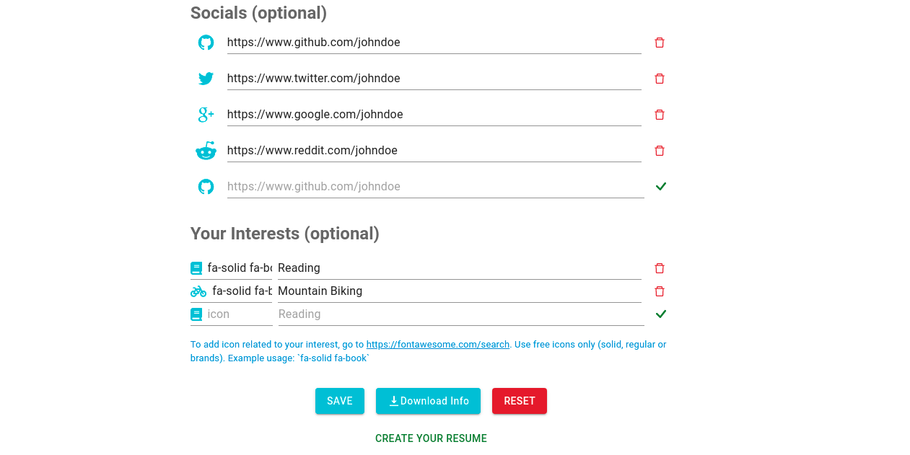
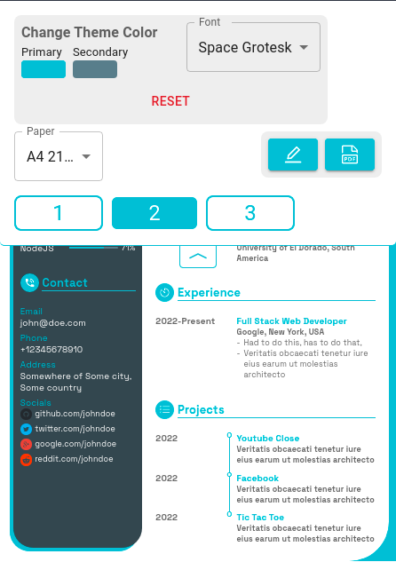
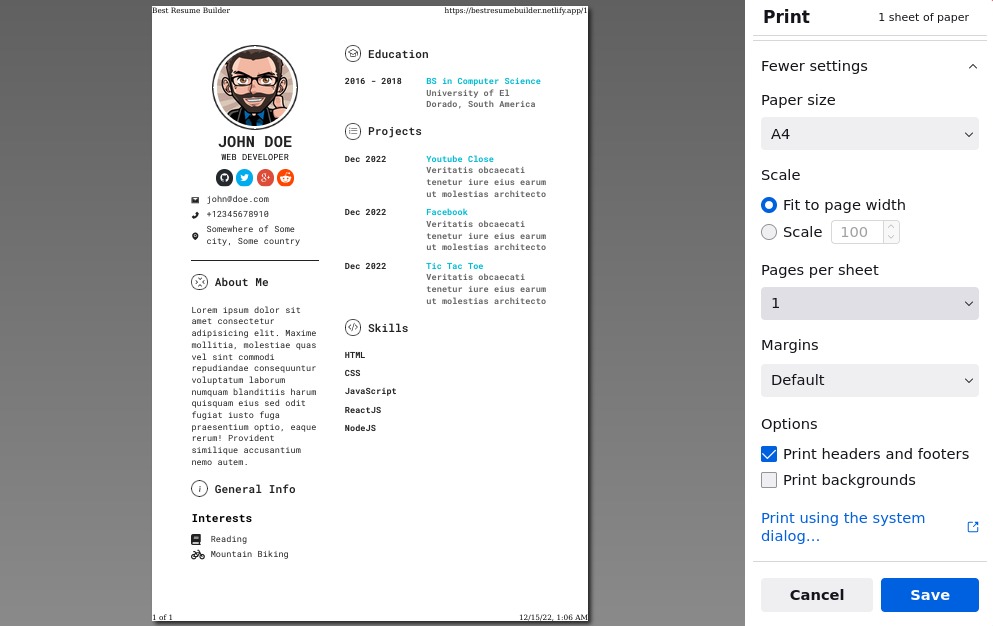

## This web app lets you generate resumes according to the information you provide to it, you can customize the colors and font of the resumes and easily download them in the pdf format
----

### here are some example resumes generated with this app





# Usage
1. In the edit page, you can fill the information and click save. You can also export the information as a JSON file to your own device and can import it again in the app, so you don't have to re-enter all the information.
   
   
2. After you have saved the information, click the button ```CREATE YOUR RESUME``` and it will take you to the resume template
3. You can pull down the tools bar which allows you to change theme colors and fonts, you can navigate through resumes by clicking the navigation links. You will find other useful stuff like pdf download button and edit button there.


If you find/face any problem in the app, please open an issue and I'll try to fix it.
If you want a new design to be added in the app, then open an issue and provide the design. If it is good enough, I may create a template for it and add to the app
#### Note! if you see the headers and footer on the resume while saving it, and want to get rid of them, you have to disable them, go to advance options and disble them. You may see something like this



# Contributing
If you want to add a new template or fix some issue, then please make sure that:
1. Everything you modify/add should be responsive, from font sizes, to width and heights, to border sizes etc, and use "vw" unit for it, even to set the height of an elemenet, you have to use "vw" unit to keep it consistant accross different screen sizes.
2. To make it easy for you to modify font size, I'hv added typography variants such as ```xx-small```,```x-small```,```small```,```medium```,```large```,```x-large```,```xx-large``` and you will use them like so

   ```<Typography variant="small">Some Text</Typography>```
3. Other than that, you have to resize other stuff manually
4. You can get the information stored in the localStorage with the key "info"